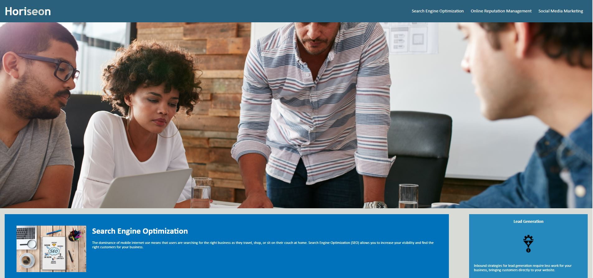
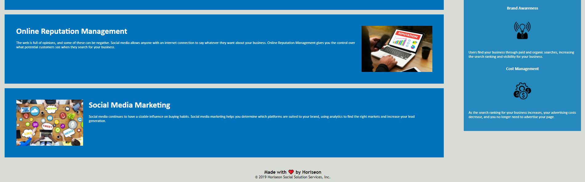

# 01 HTML CSS Git: Code Refactor

## The Header

The header contains the title of the page 'Horisean' in the top left of the webpage.

The header also includes clickable links to different sections of the webpage which can be located on the upper right hand side of the page. These links are the follwing: 
* Search Engine Optimization
* Online Reputation Management
* Social Media Marketing

## Content Section

This section contains information about Horiseon. You can navigate to this section by scrolling down or selecting from the links within the header.

## Benefit Section

Scrolling down the page also reveals the Benefit section of the page, which can be located on the right-middle side of the page. This section includes: 
* Lead Generation
* Brand Awareness
* Cost Management

## Link to Deployable Application

https://adamlaskowski1.github.io/Homework1/

## Screenshot of Deployable Application

© 2020 Trilogy Education Services, a 2U, Inc. brand. All Rights Reserved.
